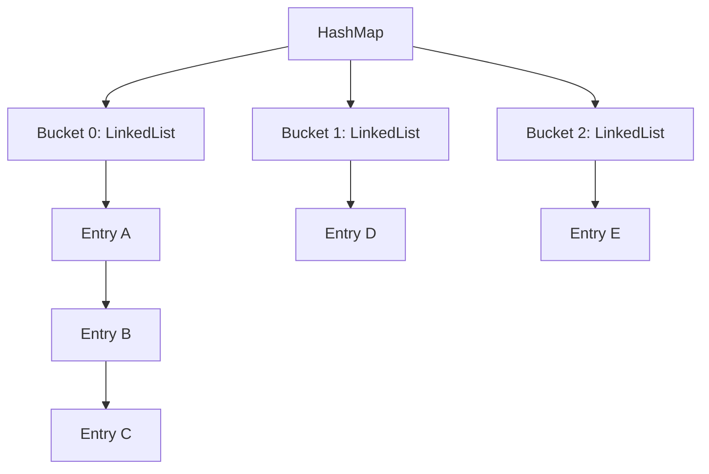

# 📚 COMP1110/1140/6710 Core Knowledge Q&A | 核心知识点问答

> Based on workshop8a-slides.pdf & workshop8b-slides.pdf  
> Australian National University Course Materials · Suitable for project reference and review  
> 
> 基于 workshop8a-slides.pdf & workshop8b-slides.pdf  
> 澳大利亚国立大学课程资料整理 · 适用于项目学习参考与复习

---

## 🎯 一、Abstract Data Types (ADT) Core Concepts | 抽象数据类型核心概念

### 🔍 Q1: Three Components of Stack ADT | Stack ADT 的三大组成

**English**: What are the "possible values", "set of operations", and "operation semantics" of the Stack ADT? Why doesn't the implementation affect its nature?  
**中文**: Stack ADT的"可能值""操作集合""操作语义"分别是什么？为什么实现不影响本质？

#### 💡 Answer | 答案

- **Possible Values | 可能值**: Finite ordered sequence following LIFO rule | 有限的、遵循"后进先出"规则的有序元素序列

- **Set of Operations | 操作集合**:
```java
push(E e)    // Add to top | 向栈顶添加元素
pop()        // Remove and return top | 移除并返回栈顶元素
peek()       // Return top without removal | 返回栈顶元素但不移除
isEmpty()    // Check if empty | 判断栈是否为空
```

- **Implementation Independence | 实现不影响本质**: ADT defines behavior, not implementation details | ADT定义行为而非实现细节

---

### 🔍 Q2: List ADT vs Implementations | List ADT 与具体实现

**English**: Relationship between List ADT and array/linked list implementations? Why "ADT is blueprint"?  
**中文**: List ADT和数组/链表实现是什么关系？为什么说"ADT是设计蓝图"？

#### 💡 Answer | 答案

**Relationship | 关系**:
- List ADT = Abstract model (design blueprint) | 抽象模型（设计蓝图）
- Array/Linked List = Concrete implementations (construction plans) | 具体实现（施工方案）

**Reason | 原因**: ADT defines behavior without memory layout | ADT定义行为而不涉及内存布局

---

### 🔍 Q3: ADT Engineering Value | ADT 的工程价值

**English**: If Team A changes List implementation from linked list to array, does Team B's code need changes? Why?  
**中文**: 如果团队A把List实现从链表改为数组，团队B的代码需要修改吗？为什么？

#### 💡 Answer | 答案

- **Need Modification? | 是否需要修改**: ❌ No | 不需要
- **Reason | 原因**: Team B depends on operation semantics, not implementation | 团队B依赖操作语义而非实现
- **Advantage | 优势**: Decouples user code from implementations | 解耦用户代码与底层实现

---

## ⚙️ 二、Java OOP & ADT Implementation | Java 面向对象与 ADT 实现

### 🔍 Q1: List<T> Generics Necessity | List<T> 泛型必要性

**English**: Why is List<T> designed as generic interface? Problems without generics?  
**中文**: 为什么List<T>要设计成泛型接口？不用泛型的问题？

#### 💡 Answer | 答案

```java
// ✅ With Generics | 泛型方案 - Type safe | 类型安全
List<String> names = new ArrayList<>();
names.add("Alice");
String name = names.get(0);

// ❌ Without Generics | 非泛型方案 - Type unsafe | 类型不安全
List names = new ArrayList();
names.add("Alice");
names.add(123);  // Mixing types | 混合类型
String name = (String) names.get(0);  // Casting needed | 需要强制转换
```

**Necessity | 必要性**: Solve type safety and casting issues | 解决类型安全和强制转换问题

---

### 🔍 Q2: Interface vs Abstract Class | 接口 vs 抽象类

**English**: When to choose interface vs abstract class for Shape?  
**中文**: Shape该选接口还是抽象类？

#### 💡 Answer | 答案

```java
// ✅ Need fields → Abstract Class | 需要字段 → 抽象类
abstract class Shape {
    protected String color = "white";
    abstract double getArea();
}

// ✅ Only behavior → Interface | 仅行为 → 接口
interface Shape {
    double getArea();
}
```

**Selection Criteria | 选择标准**:
- Need fields/default implementation → Abstract Class | 需要字段/默认实现 → 抽象类
- Only behavior contract → Interface | 仅行为契约 → 接口

---

### 🔍 Q3: Liskov Substitution Principle | 里氏替换原则

**English**: How to make PosInt conform to LSP? Does negative int violate LSP?  
**中文**: 如何让PosInt符合LSP？负int是否违反LSP？

#### 💡 Answer | 答案

```java
class PosInt {
    private final int value;
    
    private PosInt(int value) { 
        this.value = value; 
    }
    
    // Factory method with validation | 带校验的工厂方法
    public static PosInt of(int value) {
        if (value <= 0) 
            throw new IllegalArgumentException("Must be positive");
        return new PosInt(value);
    }
}
```

- **Violates LSP? | 违反LSP**: ✅ Yes | 是
- **Reason | 原因**: Negative int breaks "num>0" semantics | 负int违反"num>0"语义

---

## 📊 三、Data Structure Implementation & Performance | 数据结构实现与性能

### 🔍 Q1: Array vs Linked List Insertion | 数组与链表插入性能

**English**: Why O(n) for array head insertion vs O(1) for linked list? What about middle insertion?  
**中文**: 为什么数组头部插入O(n)而链表O(1)？中间插入呢？

#### 💡 Answer | 答案

**Performance Comparison | 性能对比**:

| Operation | Array | Linked List |
|-----------|-------|-------------|
| Head Insert | O(n) - Shift elements | O(1) - Update pointers |
| Middle Insert | O(n) - Shift后半元素 | O(n) - Traverse to position |
| Random Access | O(1) - Direct addressing | O(n) - Sequential traversal |

**Middle Insertion | 中间插入**: Not O(1), but O(n) for linked list | 链表不是O(1)，是O(n)

---

### 🔍 Q2: Doubly Linked List Deletion | 双向链表删除逻辑

**English**: After deleting element 7, how many references point to its node? Problems if only update predecessor's next?  
**中文**: 删除元素7后，原节点有多少引用指向它？只改前驱节点的next有什么问题？

#### 💡 Answer | 答案

- **Reference Count | 引用数量**: 0 references | 0个引用
- **Java Recycling | Java回收**: Garbage collection collects unreferenced objects | 垃圾回收机制回收无引用对象
- **Problems | 问题**:
  1. 🚨 Memory leak (node still referenced) | 内存泄漏（节点仍被引用）
  2. 🚨 Broken list structure | 破坏链表结构

---

### 🔍 Q3: ArrayList vs LinkedList Get Performance | get 性能对比

**English**: Why ArrayList.get() is O(1) but LinkedList.get() is O(n)? Which for frequent get(1000)?  
**中文**: 为什么ArrayList.get()是O(1)而LinkedList.get()是O(n)？频繁调用get(1000)选哪种？

#### 💡 Answer | 答案

```java
// ArrayList - O(1) Random Access | 随机访问
// Memory: [elem0][elem1][elem2]...
// Address: base + index × element size

// LinkedList - O(n) Sequential Access | 顺序访问  
// Memory: head → node1 → ... → nodeN
// Access: Must traverse from head to index
```

**Choice for get(1000) | get(1000)选择**: ✅ ArrayList  
**Reason | 原因**: O(1) vs O(1000) traversals | O(1) 对比 O(1000)次遍历

---

## 🔒 四、Access Control & Encapsulation | 访问控制与封装

### 🔍 Q1: User Class Field Modifiers | User 类字段修饰符

**English**: Why name not public? How can Student subclass access private name?  
**中文**: 为什么name不用public？Student子类如何访问private name？

#### 💡 Answer | 答案

```java
class User {
    protected String name;    // ❌ Not public: avoid direct external modification
    public final String id;   // ✅ final: assign once, immutable
    
    // Access with private name | private name的访问方式
    private String name;
    public String getName() { return name; } // Controlled access
}

class Student extends User {
    void printName() {
        System.out.println(getName()); // Access via method
    }
}
```

**Encapsulation Principle | 封装原则**: Hide unnecessary details, provide controlled access | 隐藏不必要细节，提供受控访问

---

### 🔍 Q2: Inner Class Access & Creation | 内部类访问与创建

**English**: Why can non-static inner class access outer private fields directly?  
**中文**: 为什么非静态内部类能直接访问外部类私有字段？

#### 💡 Answer | 答案

```java
class B {
    private String str;
    
    // Non-static inner class - Associated with B instance
    class C {
        void access() { 
            System.out.println(str); // ✅ Direct access
        }
    }
    
    // Static inner class - Belongs to B class
    static class D {
        void access(B b) {
            System.out.println(b.str); // ✅ Need B instance
        }
    }
}

// Create C instance outside B
B b = new B();
B.C c = b.new C();  // Need B instance first
```

---

### 🔍 Q3: Final Modifier Semantics | final 修饰符语义

**English**: Can elements be added to final List<String> hobbies? Why?  
**中文**: final的List<String> hobbies能否添加元素？为什么？

#### 💡 Answer | 答案

```java
class User {
    final String id;                    // ✅ Primitive: value immutable
    final List<String> hobbies;         // ✅ Reference: reference immutable
    
    public User() {
        id = "123";
        hobbies = new ArrayList<>();
        hobbies.add("reading");         // ✅ Can modify object content
        // hobbies = new LinkedList();  // ❌ Cannot change reference
    }
}
```

**Final Semantics | final语义**:
- Primitive types: Value immutable | 基本类型：值不可变
- Reference types: Reference immutable (content mutable) | 引用类型：引用不可变（内容可变）

---

## 🔄 五、Iterators & Traversal Logic | 迭代器与遍历逻辑

### 🔍 Q1: LinkedList Traversal Efficiency | LinkedList 遍历效率

**English**: Which traversal method is more efficient? Why?  
**中文**: 哪种遍历方式更高效？为什么？

#### 💡 Answer | 答案

```java
// ❌ Method ①: O(n²) - Inefficient
for(int i = 0; i < list.size(); i++) {
    list.get(i);  // Each get(i) traverses from head
}

// ✅ Method ②: O(n) - Efficient  
Iterator iter = list.iterator();
while(iter.hasNext()) {
    iter.next();  // Iterator remembers position
}
```

**Time Complexity | 时间复杂度**:
- Method ①: 1 + 2 + 3 + ... + n = O(n²)
- Method ②: n operations = O(n)

---

### 🔍 Q2: Iterator Design Principles | 迭代器设计原则

**English**: Problems if iterator returns node pointers directly? Which ADT principle violated?  
**中文**: 迭代器直接返回节点指针有什么问题？违反什么原则？

#### 💡 Answer | 答案

```java
// ❌ Dangerous design - Exposes internal structure
class BadIterator {
    public Node getCurrentNode() { 
        return currentNode;  // Exposes node reference
    }
}

// ✅ Safe design - Hides implementation  
class GoodIterator {
    public E next() { 
        E data = currentNode.data;
        currentNode = currentNode.next;
        return data;  // Returns only data
    }
}
```

**Violated Principle | 违反原则**: ADT "Hide Implementation Details" principle | ADT"隐藏实现细节"原则

---

<div align="center">
📝 <em>Document organized · Happy learning! | 文档整理完成 · 祝学习顺利!</em>
</div>

---

## 🚀 Quick Navigation | 快速导航

| Section | 章节 | Key Topics | 关键主题 |
|---------|------|------------|----------|
| 🎯 One | 一 | ADT Core Concepts | ADT核心概念 |
| ⚙️ Two | 二 | Java OOP & ADT | Java面向对象 |
| 📊 Three | 三 | Performance Analysis | 性能分析 |
| 🔒 Four | 四 | Access Control | 访问控制 |
| 🔄 Five | 五 | Iterators | 迭代器 |

**🔗 Connect**: Feel free to contribute or raise issues! | 欢迎贡献或提出问题！

---

# 🔎 六、查找与哈希（Searching & Hashing）

### 🔍 Q1: Array Search Methods | 数组查找方法

**English**: What are the two common methods to find the target ID in an array, and what are their key characteristics?  
**中文**: 在大学ID数组中查找目标ID的两种常见方法是什么，它们的核心特点是什么？

#### 💡 Answer | 答案

```java
// 🔍 Linear Scan | 线性查找 - O(n)
for (int i = 0; i < ids.length; i++) {
    if (ids[i] == targetId) return i;  // Check each element
}

// 🔍 Binary Search | 二分查找 - O(log n)
Arrays.sort(ids);  // Requires sorted array | 需要先排序
int left = 0, right = ids.length - 1;
while (left <= right) {
    int mid = left + (right - left) / 2;
    if (ids[mid] == targetId) return mid;
    else if (ids[mid] > targetId) right = mid - 1;  // Search left
    else left = mid + 1;  // Search right
}
```

**Comparison Table | 对比表格**:

| Method | Time Complexity | Requires Sorted? | Efficiency |
|--------|-----------------|------------------|------------|
| Linear Scan | O(n) | ❌ No | Less efficient for large data |
| Binary Search | O(log n) | ✅ Yes | More efficient for large data |

**线性查找**: 逐个检查元素，无需数组有序，时间复杂度O(n)  
**二分查找**: 仅适用于已排序数组，反复将查找范围减半，时间复杂度O(log n)

---

### 🔍 Q2: Java hashCode() Definition | Java hashCode() 定义

**English**: What is `hashCode()` in Java, and how is its default value calculated?  
**中文**: Java中的`hashCode()`是什么，它的默认值是如何计算的？

#### 💡 Answer | 答案

```java
Object obj = new Object();
System.out.println(obj.hashCode());  // e.g., 872627152

// Default implementation based on memory address | 基于内存地址的默认实现
// Hexadecimal: 34033bd0 → Decimal: 872627152
```

**Key Points | 关键点**:
- Returns **int value** for every object | 为每个对象返回int值
- \(2^{32}\) possible values (~4 billion) | 约40亿种可能取值
- Default: based on **memory address** | 默认基于内存地址

---

### 🔍 Q3: Hash Collisions & Solutions | 哈希碰撞与解决方案

**English**: What is a hash collision, and how does HashMap solve it?  
**中文**: 什么是哈希碰撞？HashMap是如何解决哈希碰撞的？

#### 💡 Answer | 答案



**Hash Collision | 哈希碰撞**:
- Multiple objects have same `hashCode` | 多个对象哈希码相同
- Or `hashCode % array length` gives same index | 或计算后得到相同索引

**HashMap Solution | HashMap解决方案**:
- Each array index points to a **linked list (bucket)** | 每个索引指向链表（桶）
- Use `equals()` to distinguish keys in same bucket | 用`equals()`区分同桶内的键

---

### 🔍 Q4: equals() and hashCode() Contract | equals()和hashCode()契约

**English**: What is the contract between `equals()` and `hashCode()`? What happens if we override `equals()` but not `hashCode()`?  
**中文**: `equals()`和`hashCode()`之间的契约是什么？如果重写`equals()`但不重写`hashCode()`会发生什么？

#### 💡 Answer | 答案

```java
// ✅ Correct implementation | 正确实现
@Override
public boolean equals(Object obj) {
    if (this == obj) return true;
    if (obj == null || getClass() != obj.getClass()) return false;
    MyClass other = (MyClass) obj;
    return this.field.equals(other.field);
}

@Override
public int hashCode() {
    return Objects.hash(field);  // Must override both! | 必须同时重写!
}
```

**Core Contract | 核心契约**:
- If `A.equals(B) == true` → `A.hashCode() == B.hashCode()` | 相等对象必须有相同哈希码
- Same `hashCode()` ≠ necessarily equal (hash collision) | 相同哈希码不一定相等

**Problem if only override equals() | 仅重写equals()的问题**:
- 🚨 Equal objects may have different `hashCode()` | 相等对象可能有不同哈希码
- 🚨 HashMap/HashSet stores duplicates | HashMap/HashSet会存储重复项
- 🚨 Fails deduplication | 无法实现去重效果

---

### 🔍 Q5: Good Hash Function Criteria | 优质哈希函数标准

**English**: What are the criteria for a good hash function, and why is number 31 often used?  
**中文**: 优质哈希函数的判定标准是什么？为什么常使用数字31？

#### 💡 Answer | 答案

**Criteria for Good Hash Function | 优质哈希函数标准**:

| Criterion | Description | Importance |
|-----------|-------------|------------|
| **Even Distribution** | Covers int value range | ✅ Reduces collisions |
| **Sensitivity** | Small input changes → different hashes | ✅ Avoids similar hashes |
| **Low Computational Cost** | Fast computation | ✅ Ensures efficiency |

**Why Number 31? | 为什么使用31**:

```java
// Efficient computation with 31 | 31的高效计算
31 * x = (x << 5) - x  // Bitwise operations faster | 位运算更快

// Avoids value cancellation | 避免值抵消
// 31 is odd prime → all fields contribute to final index
// 31是奇数质数 → 所有字段都影响最终索引
```

**Key Reasons | 关键原因**:
1. **Efficient**: Bitwise operations | 高效：位运算
2. **Avoids cancellation**: Odd prime property | 避免抵消：奇数质数特性

---

### 🔍 Q6: HashSet Implementation | HashSet 实现原理

**English**: How is HashSet implemented, and what core characteristics does it have?  
**中文**: HashSet是如何实现的？它具有哪些核心特性？

#### 💡 Answer | 答案

```java
// HashSet internal implementation | HashSet内部实现
public class HashSet<E> {
    private HashMap<E, Object> map;
    private static final Object PRESENT = new Object();
    
    public boolean add(E e) {
        return map.put(e, PRESENT) == null;  // Use as HashMap key
    }
    
    public boolean contains(Object o) {
        return map.containsKey(o);  // Delegate to HashMap
    }
}
```

**Core Characteristics | 核心特性**:

| Characteristic | Description | Benefit |
|----------------|-------------|---------|
| **No Duplicates** | Uses HashMap key uniqueness | ✅ Automatic deduplication |
| **No Ordering** | Elements stored by hash index | ✅ Fast access |
| **Efficient Operations** | O(1) average time complexity | ✅ High performance |

**底层原理**: 基于HashMap实现，元素作为键，忽略对应的值  
**特性**: 无重复元素、无顺序保证、操作高效(O(1))

---

### 🔍 Q7: HashMap Rehashing | HashMap 重哈希

**English**: What is rehashing in HashMap, and when does it happen?  
**中文**: HashMap中的"重哈希"是什么？它在什么情况下发生？

#### 💡 Answer | 答案

```java
// Rehashing process | 重哈希过程
void resize(int newCapacity) {
    Entry[] newTable = new Entry[newCapacity];
    for (Entry<K,V> e : table) {
        while (e != null) {
            Entry<K,V> next = e.next;
            int newIndex = hash(e.key) % newCapacity;  // Recalculate index
            e.next = newTable[newIndex];
            newTable[newIndex] = e;
            e = next;
        }
    }
    table = newTable;
}
```

**Rehashing Definition | 重哈希定义**:
- **Expands array capacity** | 扩大数组容量
- **Recomputes all key indices** | 重新计算所有键的索引
- **Migrates key-value pairs** | 迁移键值对到新桶

**When Rehashing Occurs | 重哈希发生时机**:
- 🚨 Too many elements in same bucket | 同一桶中元素过多
- 🚨 Load factor exceeded | 超过负载因子
- 🚨 Lookup efficiency degrades to O(n) | 查找效率退化到O(n)

**Purpose | 目的**: Maintain O(1) average time complexity | 保持O(1)平均时间复杂度

---

<div align="center">
🔍 <em>Searching & Hashing concepts covered · Continue exploring! | 查找与哈希概念已覆盖 · 继续探索!</em>
</div>

---

## 🚀 Quick Navigation | 快速导航

| Section | 章节 | Key Topics | 关键主题 |
|---------|------|------------|----------|
| 🎯 One | 一 | ADT Core Concepts | ADT核心概念 |
| ⚙️ Two | 二 | Java OOP & ADT | Java面向对象 |
| 📊 Three | 三 | Performance Analysis | 性能分析 |
| 🔒 Four | 四 | Access Control | 访问控制 |
| 🔄 Five | 五 | Iterators | 迭代器 |
| 🔎 Six | 六 | Searching & Hashing | 查找与哈希 |

**🔗 Connect**: Feel free to contribute or raise issues! | 欢迎贡献或提出问题！

---

